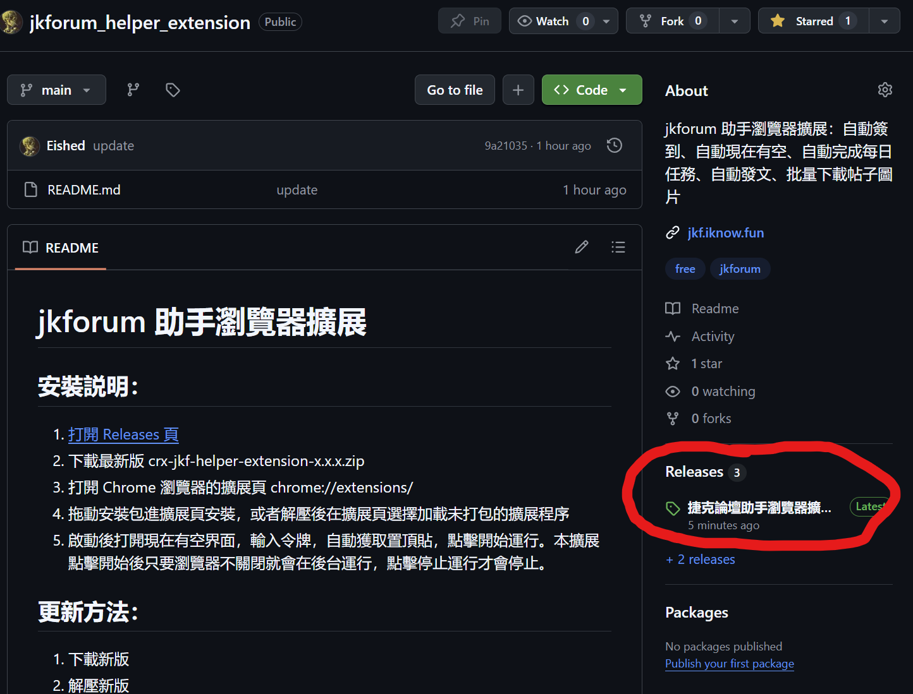
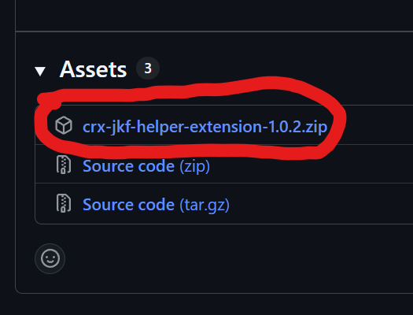
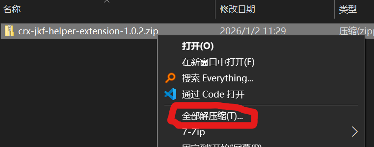
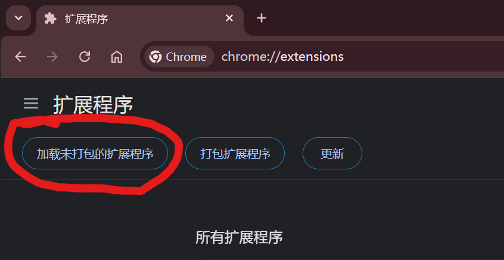
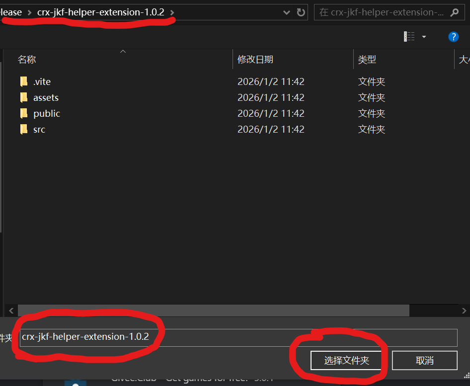
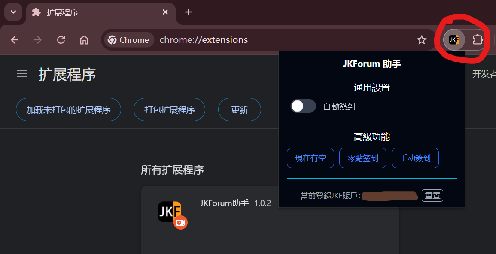

# JKForum 助手瀏覽器擴展

**JKForum助手瀏覽器擴展版 和 [篡改猴版插件-JKForum助手](https://github.com/Eished/jkforum_helper) 不能同時使用，需關閉篡改猴版插件**

## 安裝説明：

1. [打開 Releases 頁](https://github.com/Eished/jkforum_helper_extension/releases)
   - 

2. 下載最新版 crx-jkf-helper-extension-x.x.x.zip
   - 

3. 解壓下載的文件
   - 

4. 打開 Chrome 瀏覽器的擴展頁 chrome://extensions/
   - 

5. 在擴展頁選擇加載未打包的擴展程序，或者拖動安裝包(crx-jkf-helper-extension-x.x.x.zip) 進擴展頁安裝
   - 

6. 啟動後打開現在有空界面，輸入令牌，自動獲取置頂貼，點擊開始運行。本擴展點擊開始後只要瀏覽器不關閉就會在後台運行，點擊停止運行才會停止。
   - 

## 更新方法：

1. 下載新版
2. 解壓新版
3. 打開瀏覽器擴展頁
4. 找到已安裝的該擴展，點擊詳情按鈕
5. 找到最下面 來源 未打包的擴展程序 加載來源 有個鏈接，點擊進去文件夾
6. 複製新版裏面所有内容到這個文件夾，**覆蓋\替換** 原來的所有文件
7. 刷新擴展或重啓擴展，版本號更新則更新成功

## 功能

- 自動簽到
- 自動現在有空

## TODO:

- 自動完成每日任務
- 自動發文
- 批量下載帖子圖片

