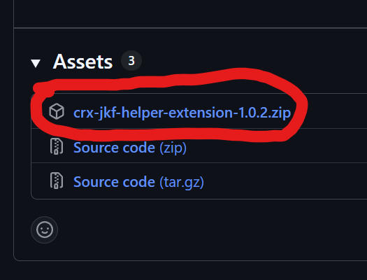
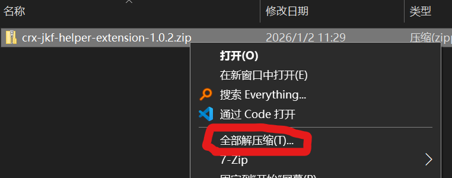
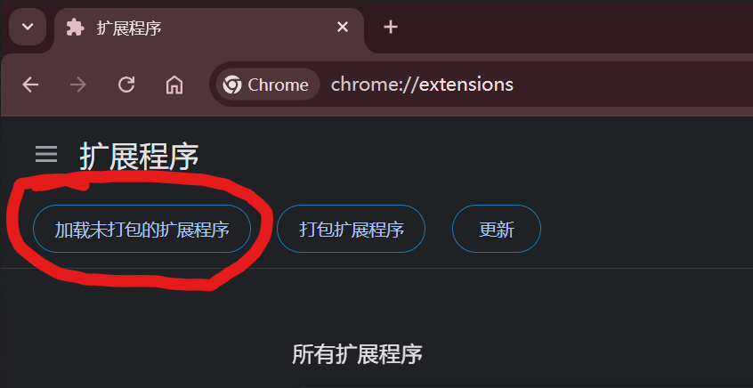
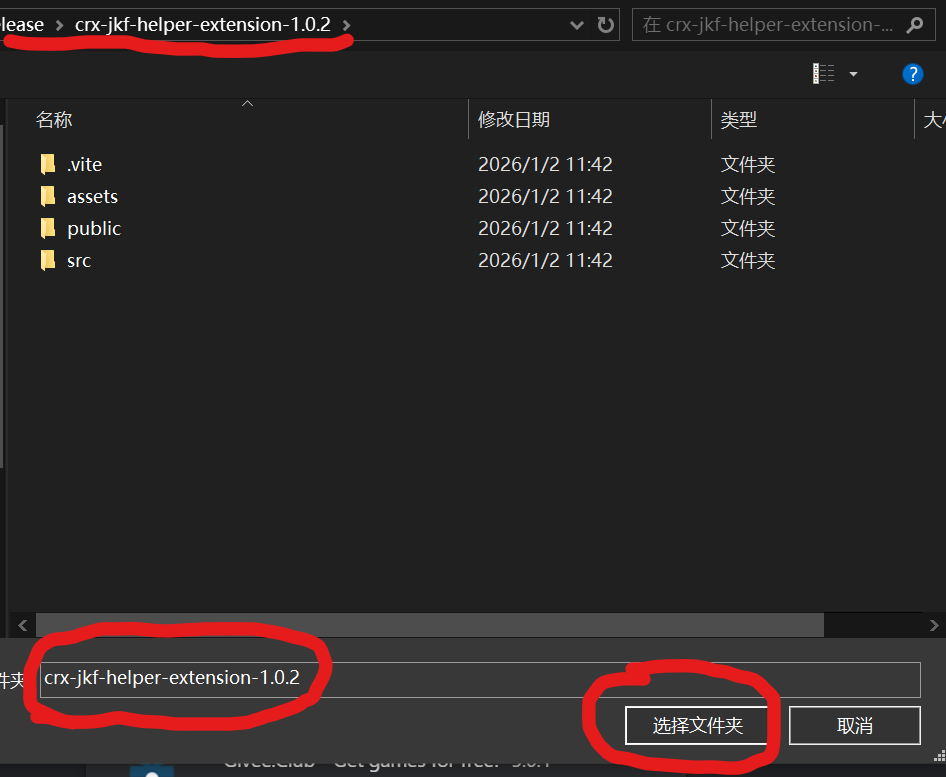
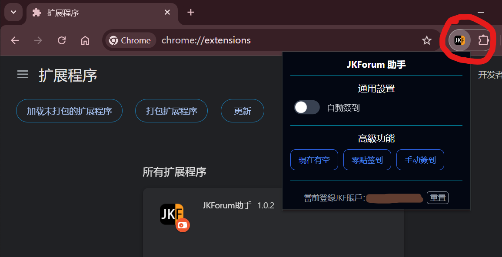

# JKForum 助手瀏覽器擴展

**JKForum助手瀏覽器擴展版 和 [JKForum助手篡改猴版插件](https://github.com/Eished/jkforum_helper) 不能同時使用，需關閉篡改猴版插件**

擴展主界面截圖展示：

## 安裝説明：

展開圖片安裝教程

1. [打開 Releases 頁](https://github.com/Eished/jkforum_helper_extension/releases)

2. 下載最新版 crx-jkf-helper-extension-x.x.x.zip

3. 解壓下載的文件

4. 打開 Chrome 瀏覽器的擴展頁 chrome://extensions/

5. 在擴展頁選擇加載未打包的擴展程序，或者拖動安裝包(crx-jkf-helper-extension-x.x.x.zip) 進擴展頁安裝

6. 啟動後打開現在有空界面，輸入令牌，自動獲取置頂貼，點擊開始運行。本擴展點擊開始後只要瀏覽器不關閉就會在後台運行，點擊停止運行才會停止。

## 更新方法：

展開更新方法

1. 下載新版（可在release頁下載，或點擊檢查更新按鈕自動下載）

2. 解壓新版

3. 打開瀏覽器擴展頁

4. 找到已安裝的該擴展，點擊詳情按鈕

5. 找到最下面 來源 未打包的擴展程序 加載來源 有個鏈接，點擊進去文件夾

6. 複製新版裏面所有内容到這個文件夾，**覆蓋\替換** 原來的所有文件

7. 刷新擴展或重啓擴展，版本號更新則更新成功

## 功能

- 自動每日簽到
  - 每天上午8點自動簽到

- 自動每日任務
  - 每天上午8點自動完成所有每日任務，然後領取所有階段獎勵

- 自動點贊文章
  - 瀏覽文章時自動點贊文章

- 自動點贊文章回復
  - 瀏覽文章時自動隨機點贊文章回復，可設置隨機點贊數量，默認1個

- 自動購買付費文章
  - 瀏覽文章時自動點擊購買

- 自動播放文章圖片
  - 瀏覽文章點擊圖片進入大圖模式時，自動播放圖片，可設置間隔時間，默認2秒

- 現在有空
  - 定時自動點擊置頂帖現在有空，默認間隔1小時

  

- 定時發文
  - 定時自動發表文章，支持任意版塊文章，默認間隔6小時

  

## 更新日志

### v1.1.0

2026-03-12

- 新增”**自动每日任务**“，支持任务与阶段奖励领取
- 增加“**定时发文**”功能与发文内容拦截保存
- 新增“**自动播放文章图片**”，支持暂停/恢复
- 新增”**自动购买付费文章**“功能
- 新增”**批量下载文章图片**“功能
- 新增”**自动点赞文章**“功能
- 新增”**自动点赞文章回復**“功能
- 增加下拉菜单欄
- 增加关于页面，更新日志完善
- 增加已保存文章列表页与关于页面入口
- 设置页增加路由功能
- 滚动条样式更新并适配暗色模式
- 进入帖子/发文页面时统一路由监听，刷新与 SPA 切换均可触发自动逻辑
- 定时发文逻辑对齐“现在有空”调度，优化重试策略并加入验证接口
- 修复动态路由下注入失败、发文 API URL 与图片资源引用问题
- 统一定时任务全局变量并整理任务结构
- 留言点赞改为从 DOM 解析，稳定性提升
- 输入框样式细节调整
- 内容页按钮仅提示消息，位置样式优化
- 增加常用功能板块与显示开关
- 现在有空停止提醒与运行状态判断优化

### v1.0.3

2026-01-02

- 修复服务器返回错误解析失败导致停止运行的问题
- 增加自动检查更新和手动检查更新功能
- 增加錯誤信息點擊狀態按鈕展示功能

### v1.0.2

2026-01-02

- 令牌錯誤漢化
- 修復重試間隔時間可能小於0
- 點擊成功加入隨機延遲
- 刷新頁面前先查詢已有頁面
- 修復502錯誤未加入重試隊列
- 規範日志輸出

### v1.0.1

2026-01-01

- 修复按时间段运行功能

### v1.0.0

2026-01-01

- 油猴脚本项目改为浏览器扩展
- 增加零点签到、自动签到、现在有空功能
